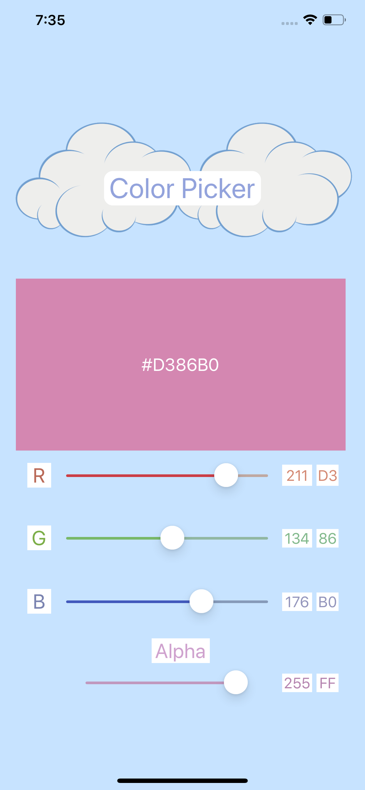
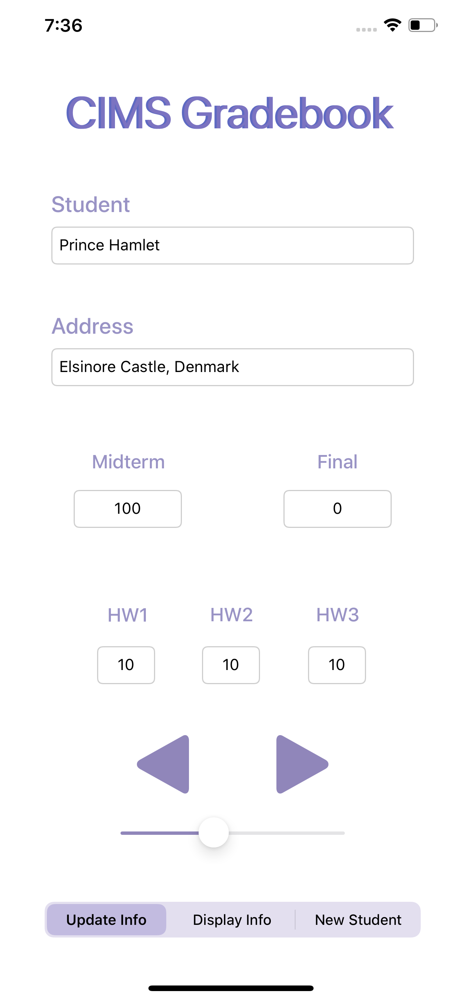
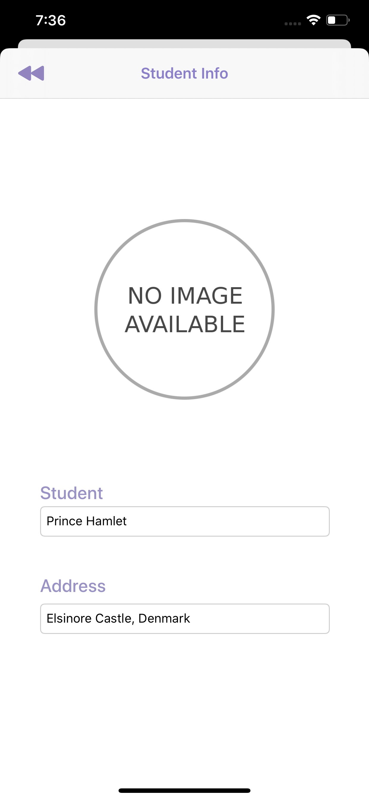
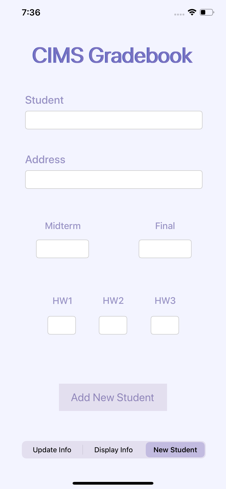
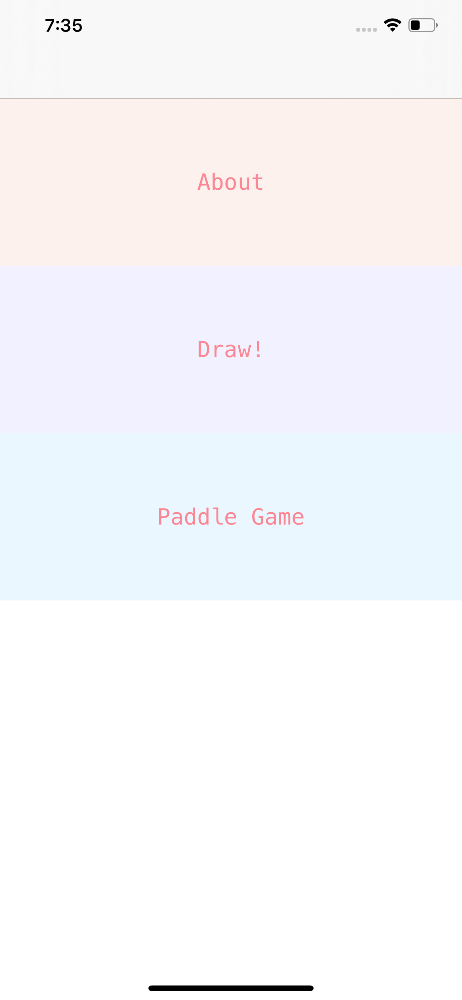
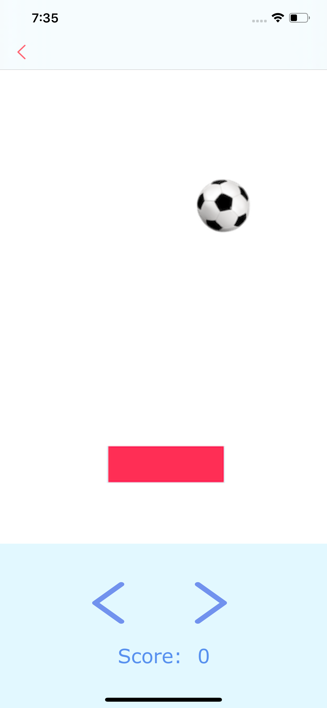

# iOS Projects
##### Note: These projects were created for my iOS development course
1. [Colorpicker](/ColorChanger) - Use RGB Sliders to create a color

2. [Gradebook](/grades) - Store and update students in a gradebook

3. [Animation](/Animation) - Play a simple paddle game and view a CG animation

